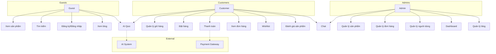
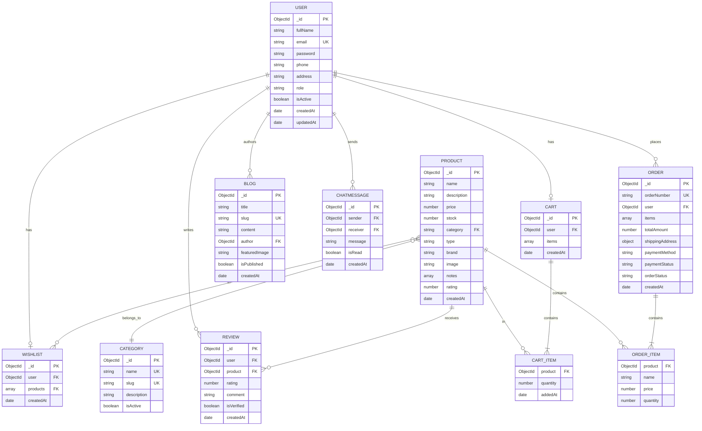

# THIẾT KẾ HỆ THỐNG - PARADISE PERFUME E-COMMERCE

## 📋 MỤC LỤC

1. [Use Case Diagram](#1-use-case-diagram)
2. [Entity Relationship Diagram (ERD)](#2-entity-relationship-diagram-erd)
3. [Kiến Trúc Hệ Thống](#3-kiến-trúc-hệ-thống)
4. [Cơ Sở Dữ Liệu](#4-cơ-sở-dữ-liệu)
5. [API Endpoints](#5-api-endpoints)
6. [Luồng Hoạt Động](#6-luồng-hoạt-động)

---

## 1. USE CASE DIAGRAM

### 1.1. Actors (Tác nhân)

- **Khách vãng lai (Guest)**: Người dùng chưa đăng nhập vào hệ thống
- **Khách hàng đã đăng nhập (Customer)**: Người dùng đã đăng ký và đăng nhập
- **Admin (Quản trị viên)**: Người quản lý hệ thống (bao gồm cả Nhân viên)
- **Hệ thống**: Bảng nhập (Database), AI System, Payment Gateway

### 1.2. Use Cases Tổng Quát

```
╔════════════════════════════════════════════════════════════════════════════╗
║                     HỆ THỐNG PARADISE PERFUME                              ║
║                      USE CASE DIAGRAM TỔNG QUÁT                            ║
╚════════════════════════════════════════════════════════════════════════════╝

┌──────────────────┐                                    ┌─────────────────────┐
│                  │                                    │                     │
│     ADMIN        │◄───────────────────────────────────┤  Khách hàng đã      │
│   (Quản trị)     │                                    │  đăng nhập          │
│                  │                                    │                     │
└────────┬─────────┘                                    └──────────┬──────────┘
         │                                                         │
         │                                                         │
         ├─── Quản lý sản phẩm                                   ├─── Quản lý đơn hàng cá nhân
         │                                                         │
         ├─── Quản lý hàng tồn                                   ├─── Quản lý thông tin cá nhân
         │                                                         │
         ├─── Quản lý người dùng                          ┌───────┼─── Xem lịch sử mua hàng
         │                                                │        │
         ├─── Quản lý danh mục                            │        ├─── Quản lý danh sách địa chỉ
         │                                                │        │
         ├─── Quản lý nhân hàng                           │        ├─── Đăng ký tài khoản
         │                                                │        │
         ├─── Quản lý chủ đề                              │        ├─── Đăng nhập thanh toán
         │                                                │        │
         ├─── Quản lý bài đăng                            │        ├─── Thêm sản phẩm vào giỏ hàng
         │                                                │        │
         ├─── Quản lý khuyến mãi                          │        ├─── Bình luận đánh giá
         │                 ┌──────────────┐               │        │
         ├─── Quản lý loại khuyến mãi     │               │        └─── Xem danh sách sản phẩm
         │                 │              │               │                     │
         ├─── Quản lý blog │              │               │                     │
         │                 │              │               │        ┌────────────┴─────────────┐
         ├─── Quản lý đơn hàng ◄──────────┘               │        │                          │
         │                                                │        │     Khách vãng lai       │
         ├─── Quản lý nhà cung cấp                        │        │        (Guest)           │
         │                                                │        │                          │
         └─── Quản lý phiếu nhập                          │        └──────────┬───────────────┘
                                                          │                   │
                                                          │                   │
                                                          │                   ├─── Xem sản phẩm bài đăng
                                                          │                   │
                                                          │                   └─── Xem lọc bài đăng
                                                          │
                                                          │
                                      ┌───────────────────┴────────────────────┐
                                      │                                        │
                                      │         BẢNG NHẬP                      │
                                      │       (Database System)                │
                                      │                                        │
                                      └────────────────────────────────────────┘

```

### 1.3. Chi tiết Use Cases theo Actor

### 1.3. Chi tiết Use Cases theo Actor

#### **ADMIN (Quản trị viên/Nhân viên) Use Cases**

```
┌─────────────────────────────────────────────────────────────┐
│                        ADMIN                                 │
├─────────────────────────────────────────────────────────────┤
│ QUẢN LÝ SẢN PHẨM:                                           │
│ 1. Thêm sản phẩm mới                                        │
│ 2. Sửa thông tin sản phẩm                                   │
│ 3. Xóa sản phẩm                                             │
│ 4. Xem danh sách sản phẩm                                   │
│                                                              │
│ QUẢN LÝ HÀNG TỒN (KHO):                                     │
│ 5. Xem tồn kho sản phẩm                                     │
│ 6. Cập nhật số lượng tồn                                    │
│ 7. Cảnh báo hết hàng                                        │
│                                                              │
│ QUẢN LÝ NGƯỜI DÙNG:                                         │
│ 8. Xem danh sách người dùng                                 │
│ 9. Khóa/Mở khóa tài khoản                                   │
│ 10. Phân quyền (Admin/Customer)                            │
│                                                              │
│ QUẢN LÝ DANH MỤC:                                           │
│ 11. Thêm danh mục (Category)                               │
│ 12. Sửa danh mục                                            │
│ 13. Xóa danh mục                                            │
│                                                              │
│ QUẢN LÝ NHÃN HÀNG (BRAND):                                  │
│ 14. Thêm thương hiệu                                        │
│ 15. Sửa thông tin thương hiệu                               │
│ 16. Xóa thương hiệu                                         │
│                                                              │
│ QUẢN LÝ CHỦ ĐỀ (TAGS):                                     │
│ 17. Tạo tag/chủ đề                                          │
│ 18. Gán tag cho sản phẩm/blog                              │
│                                                              │
│ QUẢN LÝ BÀI ĐĂNG (BLOG):                                    │
│ 19. Tạo bài viết blog                                       │
│ 20. Sửa/Xóa bài viết                                        │
│ 21. Quản lý nội dung (TinyMCE)                              │
│ 22. Xuất bản/Ẩn bài viết                                    │
│                                                              │
│ QUẢN LÝ KHUYẾN MÃI (COUPON):                                │
│ 23. Tạo mã giảm giá                                         │
│ 24. Sửa/Xóa coupon                                          │
│ 25. Theo dõi sử dụng coupon                                 │
│                                                              │
│ QUẢN LÝ LOẠI KHUYẾN MÃI:                                    │
│ 26. Giảm giá theo %                                         │
│ 27. Giảm giá cố định                                        │
│ 28. Freeship                                                 │
│ 29. Mua X tặng Y                                            │
│                                                              │
│ QUẢN LÝ ĐƠN HÀNG:                                           │
│ 30. Xem tất cả đơn hàng                                     │
│ 31. Cập nhật trạng thái đơn (Pending→Processing→Shipping   │
│     →Delivered→Cancelled)                                   │
│ 32. Xác nhận thanh toán                                     │
│ 33. Hủy đơn hàng                                            │
│ 34. Xuất hóa đơn/In đơn hàng                                │
│                                                              │
│ QUẢN LÝ NHÀ CUNG CẤP:                                       │
│ 35. Thêm nhà cung cấp                                       │
│ 36. Sửa thông tin nhà cung cấp                              │
│ 37. Quản lý hợp đồng                                        │
│                                                              │
│ QUẢN LÝ PHIẾU NHẬP:                                         │
│ 38. Tạo phiếu nhập hàng                                     │
│ 39. Xác nhận nhập kho                                       │
│ 40. Cập nhật tồn kho sau nhập                               │
│                                                              │
│ THỐNG KÊ & BÁO CÁO:                                         │
│ 41. Dashboard tổng quan                                     │
│ 42. Thống kê doanh thu                                      │
│ 43. Thống kê sản phẩm bán chạy                              │
│ 44. Thống kê người dùng                                     │
│ 45. Báo cáo tồn kho                                         │
│                                                              │
│ CHAT & HỖ TRỢ:                                              │
│ 46. Chat real-time với khách hàng                           │
│ 47. Trả lời câu hỏi                                         │
└─────────────────────────────────────────────────────────────┘
```

#### **KHÁCH HÀNG ĐÃ ĐĂNG NHẬP Use Cases**

```
┌─────────────────────────────────────────────────────────────┐
│              KHÁCH HÀNG ĐÃ ĐĂNG NHẬP                        │
├─────────────────────────────────────────────────────────────┤
│ QUẢN LÝ ĐƠN HÀNG CÁ NHÂN:                                   │
│ 1. Xem lịch sử đơn hàng                                     │
│ 2. Xem chi tiết đơn hàng                                    │
│ 3. Hủy đơn hàng (nếu status = pending)                     │
│ 4. Theo dõi trạng thái giao hàng                            │
│                                                              │
│ QUẢN LÝ THÔNG TIN CÁ NHÂN:                                  │
│ 5. Xem thông tin tài khoản                                  │
│ 6. Cập nhật profile (tên, SĐT, địa chỉ)                    │
│ 7. Đổi mật khẩu                                             │
│ 8. Upload avatar                                             │
│                                                              │
│ XEM LỊCH SỬ MUA HÀNG:                                       │
│ 9. Xem tất cả đơn đã đặt                                    │
│ 10. Lọc theo trạng thái                                     │
│ 11. Tìm kiếm đơn hàng                                       │
│ 12. Tải hóa đơn                                             │
│                                                              │
│ QUẢN LÝ DANH SÁCH ĐỊA CHỈ:                                  │
│ 13. Thêm địa chỉ giao hàng mới                              │
│ 14. Sửa địa chỉ                                             │
│ 15. Xóa địa chỉ                                             │
│ 16. Đặt địa chỉ mặc định                                    │
│ 17. Lưu nhiều địa chỉ (nhà, cty, khác)                     │
│                                                              │
│ ĐĂNG KÝ TÀI KHOẢN:                                          │
│ 18. Đăng ký bằng email/password                             │
│ 19. Xác thực email                                          │
│ 20. Tạo profile ban đầu                                     │
│                                                              │
│ ĐĂNG NHẬP/THANH TOÁN:                                       │
│ 21. Đăng nhập hệ thống                                      │
│ 22. Checkout - Thanh toán đơn hàng                         │
│ 23. Chọn phương thức thanh toán (COD/VNPay/MoMo/TP Bank)   │
│ 24. Xác nhận thanh toán online                              │
│ 25. Áp dụng mã giảm giá                                     │
│                                                              │
│ THÊM SẢN PHẨM VÀO GIỎ HÀNG:                                 │
│ 26. Thêm sản phẩm vào giỏ                                   │
│ 27. Cập nhật số lượng                                       │
│ 28. Xóa sản phẩm khỏi giỏ                                   │
│ 29. Lưu giỏ hàng (sync với server)                         │
│                                                              │
│ BÌNH LUẬN ĐÁNH GIÁ:                                         │
│ 30. Viết review sản phẩm (1-5 sao)                         │
│ 31. Upload hình ảnh review                                  │
│ 32. Sửa/Xóa review của mình                                 │
│ 33. Xem review người khác                                   │
│                                                              │
│ XEM DANH SÁCH SẢN PHẨM:                                     │
│ 34. Browse tất cả sản phẩm                                  │
│ 35. Xem chi tiết sản phẩm                                   │
│ 36. Tìm kiếm sản phẩm                                       │
│ 37. Lọc theo giá, category, brand                          │
│ 38. Sắp xếp (giá, rating, mới nhất)                        │
│ 39. Thêm vào Wishlist (Yêu thích)                          │
│ 40. Sử dụng AI tư vấn (Quiz/Chatbot)                       │
│                                                              │
│ TÍNH NĂNG BỔ SUNG:                                          │
│ 41. Chat với Admin                                          │
│ 42. Nhận thông báo đơn hàng                                 │
│ 43. Xem blog nước hoa                                       │
│ 44. So sánh sản phẩm                                        │
└─────────────────────────────────────────────────────────────┘
```

#### **KHÁCH VÃNG LAI (Guest) Use Cases**

```
┌─────────────────────────────────────────────────────────────┐
│                        GUEST                                 │
├─────────────────────────────────────────────────────────────┤
│ 1. Xem danh sách sản phẩm                                   │
│ 2. Tìm kiếm sản phẩm                                        │
│ 3. Lọc sản phẩm (theo giá, category, brand)                │
│ 4. Xem chi tiết sản phẩm                                    │
│ 5. Xem đánh giá sản phẩm                                    │
│ 6. Đăng ký tài khoản                                        │
│ 7. Đăng nhập                                                 │
│ 8. Xem blog                                                  │
│ 9. Sử dụng AI gợi ý sản phẩm (quiz)                        │
└─────────────────────────────────────────────────────────────┘
```

#### **CUSTOMER Use Cases** (+ All Guest Features)

```
┌─────────────────────────────────────────────────────────────┐
│                      CUSTOMER                                │
├─────────────────────────────────────────────────────────────┤
│ 1. Thêm sản phẩm vào giỏ hàng                               │
│ 2. Xem/Cập nhật giỏ hàng                                    │
│ 3. Xóa sản phẩm khỏi giỏ hàng                               │
│ 4. Đặt hàng (Checkout)                                      │
│ 5. Chọn phương thức thanh toán (COD/VNPay/MoMo)            │
│ 6. Thanh toán online                                         │
│ 7. Xem lịch sử đơn hàng                                     │
│ 8. Xem chi tiết đơn hàng                                    │
│ 9. Hủy đơn hàng (nếu chưa xử lý)                           │
│ 10. Thêm/Xóa sản phẩm yêu thích (Wishlist)                 │
│ 11. Đánh giá sản phẩm (Review & Rating)                    │
│ 12. Cập nhật thông tin cá nhân                              │
│ 13. Đổi mật khẩu                                            │
│ 14. Chat với admin (Real-time)                             │
│ 15. Nhận thông báo đơn hàng                                 │
│ 16. Xem gợi ý AI cá nhân hóa                               │
└─────────────────────────────────────────────────────────────┘
```

#### **ADMIN Use Cases**

```
┌─────────────────────────────────────────────────────────────┐
│                        ADMIN                                 │
├─────────────────────────────────────────────────────────────┤
│ QUẢN LÝ SẢN PHẨM:                                           │
│ 1. Thêm sản phẩm mới                                        │
│ 2. Sửa thông tin sản phẩm                                   │
│ 3. Xóa sản phẩm                                             │
│ 4. Quản lý danh mục (Category)                              │
│ 5. Quản lý kho (Stock)                                      │
│                                                              │
│ QUẢN LÝ ĐỐN HÀNG:                                           │
│ 6. Xem danh sách đơn hàng                                   │
│ 7. Cập nhật trạng thái đơn hàng                             │
│ 8. Xác nhận thanh toán                                      │
│ 9. Hủy đơn hàng                                             │
│ 10. Xuất báo cáo đơn hàng                                   │
│                                                              │
│ QUẢN LÝ NGƯỜI DÙNG:                                         │
│ 11. Xem danh sách người dùng                                │
│ 12. Khóa/Mở khóa tài khoản                                  │
│ 13. Phân quyền                                              │
│                                                              │
│ QUẢN LÝ BLOG:                                               │
│ 14. Tạo bài viết blog                                       │
│ 15. Sửa/Xóa bài viết                                        │
│ 16. Quản lý nội dung (TinyMCE)                              │
│                                                              │
│ THỐNG KÊ & BÁO CÁO:                                         │
│ 17. Xem dashboard tổng quan                                 │
│ 18. Thống kê doanh thu                                      │
│ 19. Thống kê sản phẩm bán chạy                              │
│ 20. Thống kê người dùng                                     │
│                                                              │
│ CHAT & HỖ TRỢ:                                              │
│ 21. Chat real-time với khách hàng                           │
│ 22. Trả lời câu hỏi                                         │
└─────────────────────────────────────────────────────────────┘
```

### 1.3. Use Case Diagram (Mermaid)



---

## 2. ENTITY RELATIONSHIP DIAGRAM (ERD)

### 2.1. Entities (Thực thể)

#### **User (Người dùng)**

```
User
├── _id: ObjectId (PK)
├── fullName: String
├── email: String (Unique)
├── password: String (Hashed)
├── phone: String
├── address: String
├── role: String (customer/admin)
├── isActive: Boolean
├── createdAt: Date
└── updatedAt: Date
```

#### **Product (Sản phẩm)**

```
Product
├── _id: ObjectId (PK)
├── name: String
├── description: String
├── price: Number
├── originalPrice: Number
├── stock: Number
├── category: String (FK -> Category)
├── type: String (men/women/unisex)
├── brand: String
├── volume: String
├── image: String (URL)
├── images: [String] (Gallery)
├── notes: Object
│   ├── top: [String]
│   ├── middle: [String]
│   └── base: [String]
├── rating: Number
├── reviewCount: Number
├── sold: Number
├── isActive: Boolean
├── createdAt: Date
└── updatedAt: Date
```

#### **Category (Danh mục)**

```
Category
├── _id: ObjectId (PK)
├── name: String (Unique)
├── slug: String (Unique)
├── description: String
├── image: String
├── isActive: Boolean
├── createdAt: Date
└── updatedAt: Date
```

#### **Order (Đơn hàng)**

```
Order
├── _id: ObjectId (PK)
├── orderNumber: String (Unique)
├── user: ObjectId (FK -> User)
├── items: [OrderItem]
│   ├── product: ObjectId (FK -> Product)
│   ├── name: String
│   ├── price: Number
│   ├── quantity: Number
│   └── image: String
├── totalAmount: Number
├── shippingAddress: Object
│   ├── fullName: String
│   ├── phone: String
│   ├── address: String
│   ├── city: String
│   └── district: String
├── paymentMethod: String (COD/VNPay/MoMo)
├── paymentStatus: String (pending/paid/failed)
├── orderStatus: String (pending/processing/shipping/delivered/cancelled)
├── transactionId: String
├── notes: String
├── createdAt: Date
└── updatedAt: Date
```

#### **Cart (Giỏ hàng)**

```
Cart
├── _id: ObjectId (PK)
├── user: ObjectId (FK -> User)
├── items: [CartItem]
│   ├── product: ObjectId (FK -> Product)
│   ├── quantity: Number
│   └── addedAt: Date
├── createdAt: Date
└── updatedAt: Date
```

#### **Review (Đánh giá)**

```
Review
├── _id: ObjectId (PK)
├── user: ObjectId (FK -> User)
├── product: ObjectId (FK -> Product)
├── rating: Number (1-5)
├── comment: String
├── images: [String]
├── isVerifiedPurchase: Boolean
├── createdAt: Date
└── updatedAt: Date
```

#### **Wishlist (Yêu thích)**

```
Wishlist
├── _id: ObjectId (PK)
├── user: ObjectId (FK -> User)
├── products: [ObjectId] (FK -> Product)
├── createdAt: Date
└── updatedAt: Date
```

#### **Blog (Bài viết)**

```
Blog
├── _id: ObjectId (PK)
├── title: String
├── slug: String (Unique)
├── content: String (HTML from TinyMCE)
├── excerpt: String
├── author: ObjectId (FK -> User)
├── featuredImage: String
├── category: String
├── tags: [String]
├── views: Number
├── isPublished: Boolean
├── publishedAt: Date
├── createdAt: Date
└── updatedAt: Date
```

#### **ChatMessage (Tin nhắn)**

```
ChatMessage
├── _id: ObjectId (PK)
├── sender: ObjectId (FK -> User)
├── receiver: ObjectId (FK -> User)
├── message: String
├── isRead: Boolean
├── createdAt: Date
└── updatedAt: Date
```

### 2.2. ERD Diagram (Mermaid)



---

## 3. KIẾN TRÚC HỆ THỐNG

### 3.1. Architecture Pattern: **3-Tier Architecture**

```
┌─────────────────────────────────────────────────────────────┐
│                    CLIENT TIER (Frontend)                    │
│                                                              │
│  ┌──────────────┐  ┌──────────────┐  ┌──────────────┐     │
│  │   React 19   │  │   Axios      │  │  Socket.IO   │     │
│  │   React      │  │   API Client │  │   Client     │     │
│  │   Router     │  └──────────────┘  └──────────────┘     │
│  └──────────────┘                                           │
│                                                              │
│  Components:                                                 │
│  - Pages (Home, Product, Cart, Checkout, Admin...)         │
│  - Components (Header, Footer, ProductCard...)              │
│  - Context (AuthContext, CartContext)                       │
│  - Services (API calls, Auth, Payment)                      │
│                                                              │
│  Port: 3000                                                  │
└─────────────────────────────────────────────────────────────┘
                            ↕ HTTP/HTTPS + WebSocket
┌─────────────────────────────────────────────────────────────┐
│                APPLICATION TIER (Backend API)                │
│                                                              │
│  ┌──────────────┐  ┌──────────────┐  ┌──────────────┐     │
│  │  Express.js  │  │   Socket.IO  │  │   OpenAI     │     │
│  │   REST API   │  │    Server    │  │     SDK      │     │
│  └──────────────┘  └──────────────┘  └──────────────┘     │
│                                                              │
│  Structure:                                                  │
│  ┌──────────────────────────────────────────────────┐      │
│  │  Routes (Endpoints)                              │      │
│  │  ├─ /api/auth                                    │      │
│  │  ├─ /api/products                                │      │
│  │  ├─ /api/orders                                  │      │
│  │  ├─ /api/cart                                    │      │
│  │  ├─ /api/payment                                 │      │
│  │  ├─ /api/ai (AI Recommendations)                │      │
│  │  └─ /api/blogs                                   │      │
│  └──────────────────────────────────────────────────┘      │
│                                                              │
│  ┌──────────────────────────────────────────────────┐      │
│  │  Controllers (Business Logic)                    │      │
│  │  - authController                                 │      │
│  │  - productController                              │      │
│  │  - orderController                                │      │
│  │  - paymentController                              │      │
│  │  - aiController (AI Service)                     │      │
│  └──────────────────────────────────────────────────┘      │
│                                                              │
│  ┌──────────────────────────────────────────────────┐      │
│  │  Middleware                                       │      │
│  │  - Authentication (JWT)                           │      │
│  │  - Authorization (Role-based)                     │      │
│  │  - Error Handling                                 │      │
│  │  - CORS                                           │      │
│  └──────────────────────────────────────────────────┘      │
│                                                              │
│  Port: 5000                                                  │
└─────────────────────────────────────────────────────────────┘
                            ↕ MongoDB Driver
┌─────────────────────────────────────────────────────────────┐
│                   DATA TIER (Database)                       │
│                                                              │
│  ┌──────────────────────────────────────────────────┐      │
│  │          MongoDB Atlas (Cloud Database)          │      │
│  │                                                   │      │
│  │  Collections:                                     │      │
│  │  ├─ users                                         │      │
│  │  ├─ products                                      │      │
│  │  ├─ categories                                    │      │
│  │  ├─ orders                                        │      │
│  │  ├─ carts                                         │      │
│  │  ├─ reviews                                       │      │
│  │  ├─ wishlists                                     │      │
│  │  ├─ blogs                                         │      │
│  │  └─ chatmessages                                  │      │
│  │                                                   │      │
│  │  Features:                                        │      │
│  │  - Indexing (email, orderNumber, slug)          │      │
│  │  - Validation (Mongoose Schema)                  │      │
│  │  - Relationships (References)                     │      │
│  └──────────────────────────────────────────────────┘      │
│                                                              │
│  Connection: cluster0.xijff.mongodb.net                     │
└─────────────────────────────────────────────────────────────┘
```

### 3.2. External Services

```
┌──────────────────────────────────────────────────────────────┐
│                   EXTERNAL SERVICES                           │
├──────────────────────────────────────────────────────────────┤
│                                                               │
│  ┌────────────────┐  ┌────────────────┐  ┌────────────────┐ │
│  │  OpenAI API    │  │  VNPay Gateway │  │  MoMo Gateway  │ │
│  │  (GPT-4o-mini) │  │  (Payment)     │  │  (Payment)     │ │
│  └────────────────┘  └────────────────┘  └────────────────┘ │
│         ↑                    ↑                    ↑          │
│         │                    │                    │          │
│         └────────────────────┴────────────────────┘          │
│                              │                                │
│                    Paradise Perfume API                       │
└──────────────────────────────────────────────────────────────┘
```

### 3.3. Technology Stack

```
┌─────────────────────────────────────────────────────────────┐
│                     TECHNOLOGY STACK                         │
├─────────────────────────────────────────────────────────────┤
│                                                              │
│  Frontend:                                                   │
│  - React 19 (UI Framework)                                  │
│  - React Router v7 (Routing)                                │
│  - Axios (HTTP Client)                                      │
│  - Socket.IO Client (Real-time)                             │
│  - TinyMCE (Rich Text Editor)                               │
│  - Ant Design + Material-UI (UI Components)                 │
│  - Recharts (Data Visualization)                            │
│                                                              │
│  Backend:                                                    │
│  - Node.js (Runtime)                                        │
│  - Express.js (Web Framework)                               │
│  - MongoDB + Mongoose (Database)                            │
│  - Socket.IO (WebSocket)                                    │
│  - JWT (Authentication)                                     │
│  - Bcrypt (Password Hashing)                                │
│  - OpenAI SDK (AI Integration)                              │
│  - Nodemailer (Email)                                       │
│                                                              │
│  DevOps:                                                     │
│  - Nodemon (Auto-reload)                                    │
│  - React Scripts (Build tool)                               │
│  - dotenv (Environment variables)                           │
│                                                              │
│  Payment:                                                    │
│  - VNPay Sandbox                                            │
│  - MoMo Test Environment                                    │
│                                                              │
│  AI:                                                         │
│  - OpenAI GPT-4o-mini                                       │
│  - Custom Prompt Engineering                                │
└─────────────────────────────────────────────────────────────┘
```

---

## 4. CƠ SỞ DỮ LIỆU

### 4.1. Database Schema

#### **users Collection**

```javascript
{
  _id: ObjectId("..."),
  fullName: "Nguyễn Văn A",
  email: "user@example.com",
  password: "$2b$10$...", // Hashed
  phone: "0909123456",
  address: "123 Đường ABC, Q1, TP.HCM",
  role: "customer", // customer | admin
  isActive: true,
  createdAt: ISODate("2025-01-01T00:00:00Z"),
  updatedAt: ISODate("2025-01-01T00:00:00Z")
}
```

#### **products Collection**

```javascript
{
  _id: ObjectId("..."),
  name: "Dior Sauvage EDT",
  description: "Hương thơm nam tính, mạnh mẽ...",
  price: 2500000,
  originalPrice: 3000000,
  stock: 50,
  category: "men",
  type: "Eau de Toilette",
  brand: "Dior",
  volume: "100ml",
  image: "/images/dior-sauvage.jpg",
  images: ["/images/dior-1.jpg", "/images/dior-2.jpg"],
  notes: {
    top: ["Bergamot", "Pepper"],
    middle: ["Lavender", "Geranium"],
    base: ["Ambroxan", "Cedar"]
  },
  rating: 4.8,
  reviewCount: 125,
  sold: 230,
  isActive: true,
  createdAt: ISODate("2025-01-01T00:00:00Z"),
  updatedAt: ISODate("2025-01-01T00:00:00Z")
}
```

#### **orders Collection**

```javascript
{
  _id: ObjectId("..."),
  orderNumber: "ORD-20250101-001",
  user: ObjectId("user_id"),
  items: [
    {
      product: ObjectId("product_id"),
      name: "Dior Sauvage EDT",
      price: 2500000,
      quantity: 2,
      image: "/images/dior-sauvage.jpg"
    }
  ],
  totalAmount: 5000000,
  shippingAddress: {
    fullName: "Nguyễn Văn A",
    phone: "0909123456",
    address: "123 Đường ABC",
    city: "TP.HCM",
    district: "Quận 1"
  },
  paymentMethod: "VNPay",
  paymentStatus: "paid", // pending | paid | failed
  orderStatus: "processing", // pending | processing | shipping | delivered | cancelled
  transactionId: "VNPAY123456",
  notes: "Giao giờ hành chính",
  createdAt: ISODate("2025-01-01T10:00:00Z"),
  updatedAt: ISODate("2025-01-01T10:00:00Z")
}
```

### 4.2. Indexes

```javascript
// Indexing cho performance
db.users.createIndex({ email: 1 }, { unique: true });
db.products.createIndex({ name: "text", description: "text" });
db.products.createIndex({ category: 1, price: 1 });
db.orders.createIndex({ orderNumber: 1 }, { unique: true });
db.orders.createIndex({ user: 1, createdAt: -1 });
db.blogs.createIndex({ slug: 1 }, { unique: true });
db.reviews.createIndex({ product: 1, user: 1 });
```

### 4.3. Database Relationships

```
User (1) ────────> (N) Orders
User (1) ────────> (1) Cart
User (1) ────────> (N) Reviews
User (1) ────────> (1) Wishlist
User (1) ────────> (N) Blogs

Product (1) ────> (N) Order Items
Product (1) ────> (N) Cart Items
Product (1) ────> (N) Reviews
Product (N) <───> (N) Wishlist

Category (1) ───> (N) Products
```

---

## 5. API ENDPOINTS

### 5.1. Authentication APIs

```
POST   /api/auth/register          - Đăng ký
POST   /api/auth/login             - Đăng nhập
GET    /api/auth/profile           - Lấy thông tin user [Auth]
PUT    /api/auth/profile           - Cập nhật profile [Auth]
PUT    /api/auth/change-password   - Đổi mật khẩu [Auth]
POST   /api/auth/logout            - Đăng xuất [Auth]
```

### 5.2. Product APIs

```
GET    /api/products               - Danh sách sản phẩm
GET    /api/products/:id           - Chi tiết sản phẩm
POST   /api/products               - Tạo sản phẩm [Admin]
PUT    /api/products/:id           - Cập nhật sản phẩm [Admin]
DELETE /api/products/:id           - Xóa sản phẩm [Admin]
GET    /api/products/search        - Tìm kiếm sản phẩm
GET    /api/products/category/:cat - Lọc theo category
```

### 5.3. Order APIs

```
GET    /api/orders                 - Danh sách đơn hàng [Auth]
GET    /api/orders/:id             - Chi tiết đơn hàng [Auth]
POST   /api/orders                 - Tạo đơn hàng [Auth]
PUT    /api/orders/:id/status      - Cập nhật trạng thái [Admin]
DELETE /api/orders/:id             - Hủy đơn hàng [Auth]
GET    /api/admin/orders           - Tất cả đơn hàng [Admin]
```

### 5.4. Cart APIs

```
GET    /api/cart                   - Lấy giỏ hàng [Auth]
POST   /api/cart                   - Thêm vào giỏ [Auth]
PUT    /api/cart/:itemId           - Cập nhật số lượng [Auth]
DELETE /api/cart/:itemId           - Xóa khỏi giỏ [Auth]
DELETE /api/cart                   - Xóa toàn bộ giỏ [Auth]
```

### 5.5. Payment APIs

```
POST   /api/payment/vnpay/create   - Tạo link thanh toán VNPay
GET    /api/payment/vnpay/callback - Callback VNPay
POST   /api/payment/momo/create    - Tạo link thanh toán MoMo
POST   /api/payment/momo/callback  - Callback MoMo
```

### 5.6. AI Recommendation APIs

```
GET    /api/ai/quiz                - Lấy câu hỏi quiz
POST   /api/ai/recommend           - Gợi ý sản phẩm AI
POST   /api/ai/feedback            - Feedback gợi ý
```

### 5.7. Blog APIs

```
GET    /api/blogs                  - Danh sách blog
GET    /api/blogs/:slug            - Chi tiết blog
POST   /api/blogs                  - Tạo blog [Admin]
PUT    /api/blogs/:id              - Cập nhật blog [Admin]
DELETE /api/blogs/:id              - Xóa blog [Admin]
```

### 5.8. Review APIs

```
GET    /api/reviews/product/:id    - Đánh giá của sản phẩm
POST   /api/reviews                - Tạo đánh giá [Auth]
PUT    /api/reviews/:id            - Sửa đánh giá [Auth]
DELETE /api/reviews/:id            - Xóa đánh giá [Auth/Admin]
```

### 5.9. Wishlist APIs

```
GET    /api/wishlist               - Lấy wishlist [Auth]
POST   /api/wishlist/:productId    - Thêm sản phẩm [Auth]
DELETE /api/wishlist/:productId    - Xóa sản phẩm [Auth]
```

### 5.10. Category APIs

```
GET    /api/categories             - Danh sách danh mục
GET    /api/categories/:id         - Chi tiết danh mục
POST   /api/categories             - Tạo danh mục [Admin]
PUT    /api/categories/:id         - Cập nhật danh mục [Admin]
DELETE /api/categories/:id         - Xóa danh mục [Admin]
```

### 5.11. Admin APIs

```
GET    /api/admin/dashboard        - Thống kê tổng quan [Admin]
GET    /api/admin/users            - Quản lý người dùng [Admin]
PUT    /api/admin/users/:id        - Cập nhật user [Admin]
GET    /api/admin/stats/revenue    - Thống kê doanh thu [Admin]
GET    /api/admin/stats/products   - Thống kê sản phẩm [Admin]
```

---

## 6. LUỒNG HOẠT ĐỘNG

### 6.1. Luồng Đăng Ký & Đăng Nhập

```
┌─────────┐         ┌─────────┐         ┌──────────┐
│ Client  │         │  Server │         │ Database │
└────┬────┘         └────┬────┘         └─────┬────┘
     │                   │                     │
     │ POST /auth/register                     │
     │ {email, password} │                     │
     ├──────────────────>│                     │
     │                   │ Hash password       │
     │                   │ (bcrypt)            │
     │                   │                     │
     │                   │ Save user           │
     │                   ├────────────────────>│
     │                   │                     │
     │                   │<────────────────────┤
     │                   │ Generate JWT        │
     │<──────────────────┤ {token, user}       │
     │                   │                     │
     │ Store token       │                     │
     │ (localStorage)    │                     │
     │                   │                     │
```

### 6.2. Luồng Mua Hàng

```
┌────────┐  ┌────────┐  ┌─────────┐  ┌─────────┐  ┌──────────┐
│ Client │  │  Cart  │  │ Checkout│  │ Payment │  │ Database │
└───┬────┘  └───┬────┘  └────┬────┘  └────┬────┘  └─────┬────┘
    │           │            │            │             │
    │ Add to Cart           │            │             │
    ├──────────>│            │            │             │
    │           │ Store cart │            │             │
    │           ├───────────────────────────────────────>│
    │           │            │            │             │
    │ View Cart │            │            │             │
    │<──────────┤            │            │             │
    │           │            │            │             │
    │ Checkout  │            │            │             │
    ├────────────────────────>│            │             │
    │           │            │ Create Order            │
    │           │            ├────────────────────────>│
    │           │            │            │             │
    │           │            │ Choose Payment          │
    │           │            ├───────────>│             │
    │           │            │            │ Process     │
    │           │            │            │ (VNPay/MoMo)│
    │           │            │<───────────┤             │
    │           │            │ Redirect   │             │
    │<────────────────────────┤            │             │
    │           │            │            │             │
    │ Payment Callback       │            │             │
    ├────────────────────────────────────>│             │
    │           │            │            │ Update Order│
    │           │            │            ├────────────>│
    │           │            │            │             │
    │ Order Success          │            │             │
    │<─────────────────────────────────────────────────┤
    │           │            │            │             │
```

### 6.3. Luồng AI Recommendation

```
┌─────────┐         ┌─────────┐         ┌──────────┐         ┌────────┐
│ Client  │         │  Server │         │ Database │         │ OpenAI │
└────┬────┘         └────┬────┘         └─────┬────┘         └───┬────┘
     │                   │                     │                  │
     │ GET /ai/quiz      │                     │                  │
     ├──────────────────>│                     │                  │
     │<──────────────────┤ Return questions    │                  │
     │                   │                     │                  │
     │ User answers quiz │                     │                  │
     │                   │                     │                  │
     │ POST /ai/recommend                      │                  │
     │ {preferences}     │                     │                  │
     ├──────────────────>│                     │                  │
     │                   │ Get products        │                  │
     │                   ├────────────────────>│                  │
     │                   │<────────────────────┤                  │
     │                   │                     │                  │
     │                   │ Build AI prompt     │                  │
     │                   │ (user + products)   │                  │
     │                   │                     │                  │
     │                   │ Call OpenAI API     │                  │
     │                   ├─────────────────────────────────────>│
     │                   │                     │                  │
     │                   │ AI Analysis         │                  │
     │                   │<─────────────────────────────────────┤
     │                   │ (GPT-4o-mini)       │                  │
     │                   │                     │                  │
     │                   │ Enrich with         │                  │
     │                   │ product data        │                  │
     │<──────────────────┤ Return              │                  │
     │ Display results   │ recommendations     │                  │
     │                   │                     │                  │
```

### 6.4. Luồng Real-time Chat

```
┌──────────┐         ┌─────────┐         ┌──────────┐
│ Customer │         │  Server │         │  Admin   │
│ (Socket) │         │(Socket.IO)        │ (Socket) │
└────┬─────┘         └────┬────┘         └─────┬────┘
     │                    │                     │
     │ Connect            │                     │
     ├───────────────────>│                     │
     │ join('user-123')   │                     │
     │                    │                     │
     │                    │    Connect          │
     │                    │<────────────────────┤
     │                    │ join('admin')       │
     │                    │                     │
     │ Send message       │                     │
     ├───────────────────>│                     │
     │                    │ Save to DB          │
     │                    │                     │
     │                    │ Emit to admin       │
     │                    ├────────────────────>│
     │                    │                     │
     │                    │ Admin reply         │
     │                    │<────────────────────┤
     │                    │ Save to DB          │
     │<───────────────────┤                     │
     │ Display message    │ Emit to user        │
     │                    │                     │
```

---

## 7. SECURITY & PERFORMANCE

### 7.1. Security Measures

```
✅ Password Hashing (bcrypt)
✅ JWT Authentication
✅ CORS Configuration
✅ Input Validation (Mongoose Schema)
✅ XSS Protection (Sanitization)
✅ Rate Limiting (Prevent DDoS)
✅ HTTPS (Production)
✅ Environment Variables (.env)
✅ Role-based Access Control
```

### 7.2. Performance Optimization

```
✅ Database Indexing
✅ Lazy Loading Images
✅ API Response Caching
✅ Code Splitting (React)
✅ Minification & Compression
✅ CDN for Static Assets
✅ WebSocket for Real-time
✅ MongoDB Aggregation Pipeline
```

---

## 📊 THỐNG KÊ DỰ ÁN

- **Tổng số Collections**: 9
- **Tổng số API Endpoints**: 50+
- **Technology Stack**: MERN + AI
- **External Services**: 3 (OpenAI, VNPay, MoMo)
- **Real-time Features**: Chat, Notifications
- **AI Integration**: GPT-4o-mini Recommendations

---

**Ngày tạo**: 19/11/2025  
**Version**: 1.0  
**Tác giả**: Paradise Perfume Development Team
